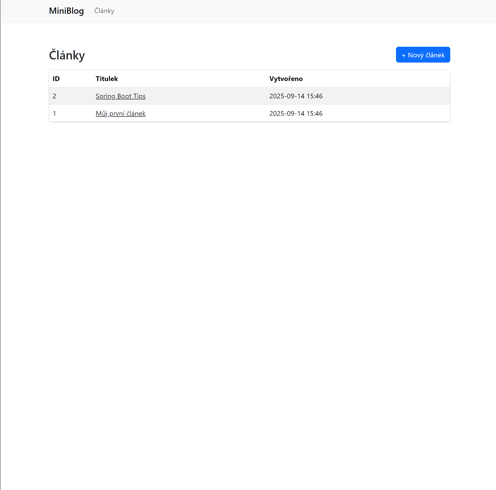
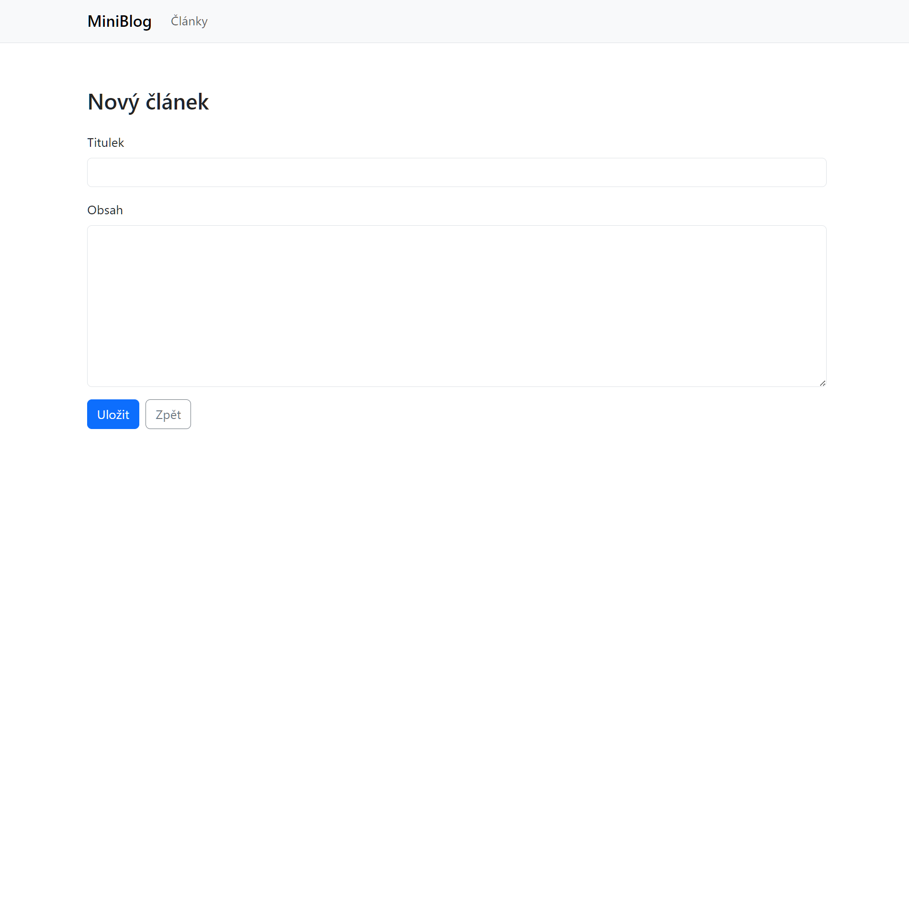
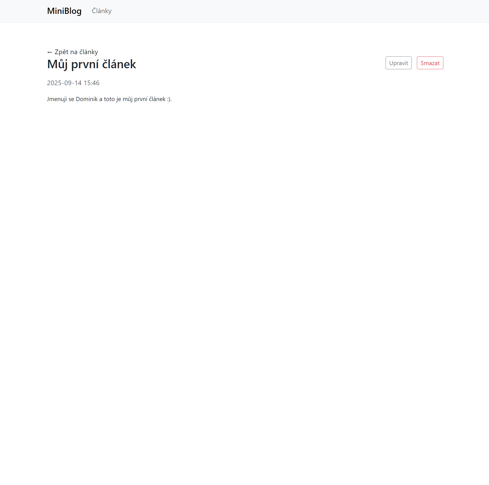
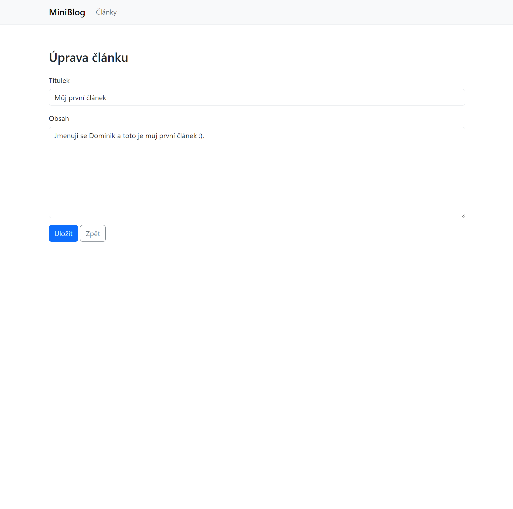
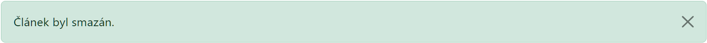
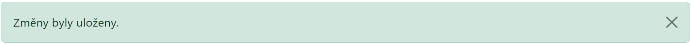
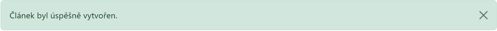
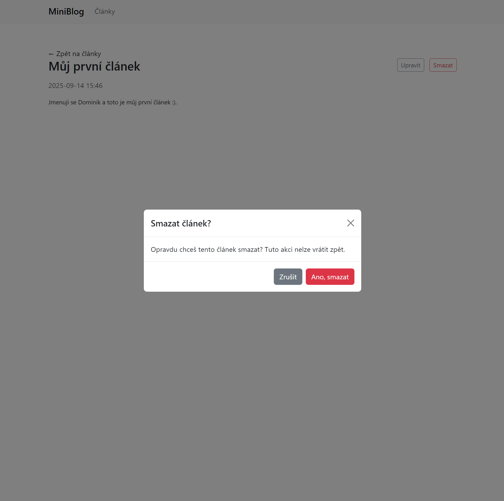

# Mini-Blog (Spring Boot + Thymeleaf + H2)

Jednoduchá blogová aplikace postavená na Spring Boot 3, Thymeleaf a H2 databázi.  
Projekt umožňuje spravovat články (CRUD operace: vytvoření, úprava, smazání, zobrazení).   

---

# Funkce:
- 📄 Výpis všech článků se stránkováním  
- ➕ Vytvoření nového článku s validací vstupů  
- ✏️ Úprava existujícího článku  
- ❌ Smazání článku (s potvrzením v modalu)  
- ⚠️ Zobrazení chybových hlášek a flash zpráv (success/error)  
- 💾 H2 databáze inicializovaná testovacími daty (`data.sql`)  

---

# Spuštění projektu

# Předpoklady:
- Java 17+  
- Maven  

# Kroky:
1. Naklonuj repozitář (CMD/PowerShell)
   - git clone https://github.com/DevbyHany/Mini-blog.git
   - cd Mini-blog

2. Spusť aplikaci (Spuštění bez instalace Mavenu (Maven Wrapper))
   - .\mvnw.cmd spring-boot:run
   
3. Otevři v prohlížeči  
   - Aplikace: [http://localhost:8080/articles](http://localhost:8080/articles)
     
---

# Použité technologie:
- Java 17  
- Spring Boot 3.3 (Web, Data JPA, Validation, Security, Thymeleaf)  
- H2 Database  
- Maven  
- Bootstrap 5 (UI)  

---

# Ukázky obrazovek:

# Výpis článků

# Formulář pro nový článek

# Detail článku

# Edit článku

# Flash zprávy

# Ostatní

---

## Další rozvoj
- Přidat autentizaci uživatelů (Spring Security, login/registrace)  
- Připojit produkční databázi (PostgreSQL/MySQL)  
- Rozšířit validace formulářů  
- Integrační testy s Testcontainers  
